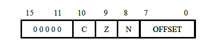
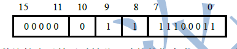
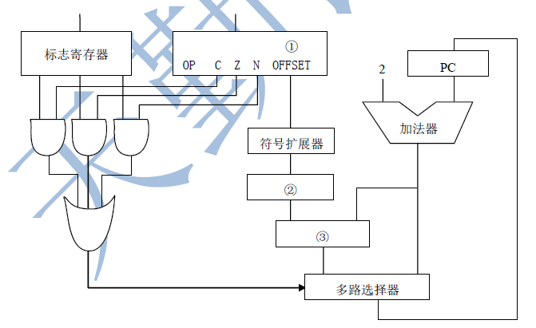

4.已知三叉树T中6个叶结点的权分别是2，3，4，5，6，7，T的带权路径长度最小是(46)

【解析】：这个是哈夫曼编码，如果2，3，4组成最底层叶结点，那么5，6，7组成同层叶结点。树为三层。路径是(2+3+4+5+6+7)\*3=81...,答案是0，2，3在最底层，组成5；5，4，5第二层；14，6，7第一层。路径是6+7+（4+5）\*2+(2+3)\*3=13+18+15=46

11.对给定的关键字序列110，119，007，911，114，120，122进行基数排序，则第2趟分配收集后得到的关键字序列是(007,110,911,114,119,120,122)

【解析】基数排序，**首先对个位排**，第二趟对十位排。因此结果应该是十位有序，在相同十位中个位有序。

**15**.校验位的位数为k，数据位的位数为n，应满足下述关系：$2^k>=n+k+1$.再记不住吔屎吧

22.中断响应发生在一条指令执行结束后，DMA响应发生在一个总线事务完成后

25.计算数据所在的柱面号，磁头号，扇区号的程序是(设备驱动程序)【这个东西不同硬件计算方法不同，所以一定要厂商根据硬件写到驱动里。不可能是中断处理程序，因为中断处理处理的是通用的东西】

38.MAC地址6B，48位

44.某计算机采用16 位定长指令字格式，其CPU 中有一个标志寄存器，其中包含进位/借位标志CF、零标志ZF 和符号标志NF。假定为该机设计了条件转移指令，其格式如下：

其中， 00000 为操作码 OP ；C、Z和 N分别为 分别为 CF 、ZF 和 NF 的对应检测位，某测位为1时表示需检测对应标志，需检测对应标志位中只要有一个为1时就转移，否则不转移，例如，若 C=1 ，Z=0 ，N=1 ，则需检测 CF 和 NF 的值，当CF=1或NF=1时发生转移；OFFSET是相对偏移量 用补码表示。转移执行时目标地址为 （PC ）+2 +2× OFFSET ；顺序执行时，下条指令地址为 （PC ）+2 。

（1）该计算机存储器按字节编址还是按字编址？该条件转移指令向后（反向 ）最多可跳转多少条指令 ？

（2）某条件转移指令的地址为200CH，指令内容如下图所示，若该执行时，CF=0，ZF=0，NF=1则该指令执行后 PC 的值是多少？若该指令执行时CF=1，ZF=0，NF=0，则该指令执行后 PC 的值又是多少 ？

（3）实现“无符号数比较小于等于时转移”功能的指令中，C、Z和N各应是什么？

（4）以下是该指令对应的数据通路示意图，要求给出图中部件1-3的名称或功能说明

【解析】

（1）按字节编址，因为指令字长是两字节，而执行完一条指令PC+2，所以这是跳过两个字节，即每个地址表示一个字节。8位补码最大正数是127，(-128~127)所以最多可跳转127条指令

（2）显然NF=1，且指令对应的NF位也为1，所以跳转，11100011,符号扩展后是11111111 11100011，左移一位(乘2)11111111 11000110，为FFC6H所以目标地址是(200CH)+2+FFC6H=1FD4H。第二问没有发生跳转，直接200CH+2即可=200EH。

（3）无符号数小于等于，所以没有符号的事，即N=0，小于等于比较是做差，所以小于时C=1，等于时Z=1.

（4）1是指令寄存器，2是位移寄存器，3是加法器

47.BGP是基于TCP的。
