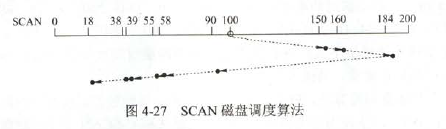

2.先序序列为a，b，c，d的不同二叉树的个数是（14）个

【解析】由于前序序列和中序序列能唯一确定一个二叉树，相当于谦虚abcd次序入栈，则中序即出栈序列的个数。$\frac{1}{1+n}C_{2n}^n=14$

10.堆删除的过程就是把顶删了之后，最右下角的数据跑到顶上来，然后再向下调整

14.左规阶码-1.左规就是左移。可能会造成阶码下溢。0.0010左规一位0.0100。右规就是右移，阶码+1.右规可能造成阶码上溢。尾数舍入有两种方法，一种是0舍1入，和4舍5入类似，结尾是1的话，舍去就在尾数加一，可能会造成阶码上溢(前面全是1).还有一种直接舍去

26.**限制用户申请资源的顺序是预防死锁的破坏循环等待条件的方法**。把他和避免死锁区分。避免死锁是通过确定进程运行的顺序来避免死锁的。

32.SCAN，扫完一面扫另一面，不是由0开始。

35.主机甲通过128kbps卫星链路，采用滑动窗口协议向主机乙发送数据，链路单向传播延迟为250ms，帧长为1000字节。不考虑确认帧的开销，为使链路利用率不小于80%，帧序列号的比特数至少是(4)。

【解析】利用率不小于80%，也就是速度是128\*0.8=102.4kbps.则总延迟是1000\*8/102.4k+500=578ms。102.4\*578ms=59Kb=7.375kB.所以能发7.3帧。但是这个序列号不只是全用来发送。后退N帧协议中，发送窗口大小+接收窗口大小=$2^n$，所以需要接收窗口最少为1个，即$2^n-1>=7.2$,所以n=4

发送周期=第一个帧的传输时延+第一个帧的传播时延+确认帧的传输时延+确认帧的传播时延

42.n个顶点的邻接矩阵$A$。则$A^m(2<=m<=n)$中非零元素的含义是顶点j到i长度为m的路径的个数

43.若无暂存寄存器，单总线结构中ALU两端将会收到相同的数据。控制信号所控制部件的名称角三态门。