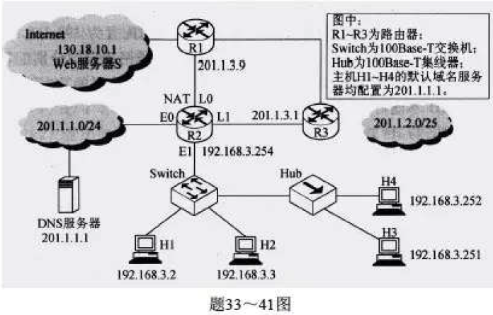

7.将n个顶点e条弧的有向图采用邻接表存储，则拓扑排序算法的时间复杂度是(O(n+e))。若用邻接矩阵表示。则时间复杂度是($O(n^2)$)

10.B+树不同于B树的特点之一是(能支持顺序查找)

20.单周期处理器中所有指令的指令周期为一个时钟周期。下列关于单周期处理器的叙述中，错误的是(可以采用单总线结构数据通路)【指令周期为一个周期的话，在一个时钟周期就要传一堆数据，单总线肯定不行】

**36.若HUB再生比特流过程中，会产生1.535us延时，信号传播速度为200m/us，不考虑以太网帧的前导码，则H3和H4之间理论上可以相距的最大距离是(205m)**

【解析】100Base-T，则速度为100Mb/s，并且以太网最小帧是64B，所以最小帧长等于(64B=2\*100Mb/s\*t),得到t是2.56us，2.56-1.535=1.025;1.025*200=205m

40.采用迭代查询方式，访问域名www.abc.xyz.com，则在DNS解析过程中，本地域名服务器发送查询的次数最少是(0次)，最多是(4次)【4次包括1次根域名服务器，1次顶级域名服务器，2次权限域名服务器】

41.注意那个啥，就是TCP接收窗口那个，如果是一个RTT,则发送窗口指数型增长，如果是一个确认段(一次发送4个，会有4个确认段)，则发送窗口长1.

44.在传送ASCII码时有一位起始字符。