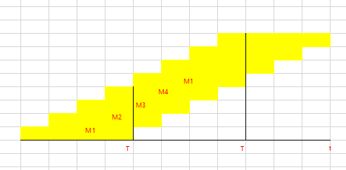

1.计算时间复杂度不容易看出来的，把表达式写出来。入sum=i(i+1)/2，则时间复杂度就是$o(n^2)$

8.如图.明显BC不对。A的右子树的分支可以看出，先查根结点，再查根结点的左子树，假设左大右小，说明降序。所以右面应该五个，而不是四个.主要看D，小的分支，是选的右面作为mid，而总的树是选的左面（左4右5），所以矛盾


11.将顺序存储改为链式存储，时间效率降低的是（希尔排序和堆排序）

12.某计算机主存按字节编址，由4个64M*8位的DRAM芯片采用交叉编址方式构成，并与宽度为32位的存储器总线相连，主存每次最多读写32位数据。若double变量x的主存地址为804001AH，则读取x需要的存储周期是(3)

```java
【解析】
DRAM说明是位扩展。每个DRAM有8位，double要64位，故需要读出8个模块。而流水线完全流动，一个周期读4个，两个周期读完。这要考虑结尾，所以3个周期
```
实际如图



需要2.75个周期

19.关于指令流水线数据通路的叙述，错误的是（A）

- 包含生成控制信号的控制部件
- 包含算数逻辑运算部件ALU
- 包含通用寄存器组和取指部件
- 由组合逻辑电路和时序逻辑电路组合而成


【解析】五段经典流水中，取指周期、移码周期、执行周期、读寄存器周期、写回周期。可见BCD都对。ALU就是组合逻辑电路。

26.若文件系统有簇的话，存取以簇为单位

29，磁盘逻辑格式化的工作是：建立文件系统的根目录；对保存空闲磁盘块信息的数据结构进行初始化

31.若文件f1的硬链接f2，两个进程分别打开f1和f2，获得对应的文件描述符为fd1，fd2.则下列叙述中，正确的是（2，3）

- f1和f2的读写指针位置相同
- f1和f2共享同一个内存索引节点
- fd1和fd2分别指向各自的用户打开文件表中的一项


35.IEEE802.11数据帧格式地址1，地址2，地址3.地之1下一条目的地址，2源地址，3目的地址

36.下列IP地址中，只能作为IP分组的源IP地址不能作为目的IP地址的是(0.0.0.0).

【解析】其他是127.0.0.1；255.255.255.255

