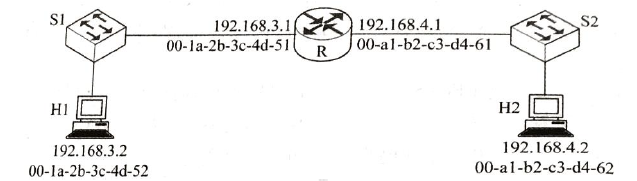

**15.某32位计算机按字节编址，采用小端方式。若语句“int i=0”对应机器码“C7 45 FC 00 00 00 00”，则“int i=-64”对应机器码是(C7 45 FC C0  FF FF FF)**

**【解析】-64是FFFF FFC0 .这里C0是低位。而指令存储在存储单元时，位是由左到右增加，就是OP存在低位，数据存在高位，所以小端的话，低存低。即C0存在数据位最低位**

16.算数位移，带符号的。算数嘛，就是算数。

19.进位/借位标志位。进位只在加法中使用，借位是在减法中。只有小数减大数时才会进位

37.以太网MAC地址只是广播域内的。

如图。H1帧目的MAC是00-1a-2b-3c-4d-51，H2源MAC是00-a1-b2-c3-d4-61