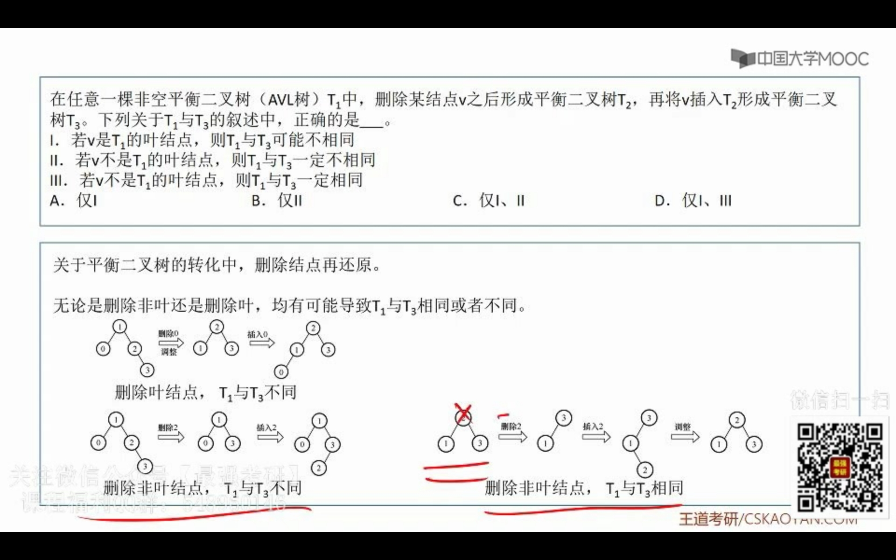
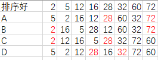
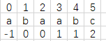

痛苦的一年

4.

10.排序过程中，对尚未确定最终位置的所有元素进行一遍遍历称为一趟。下列序列中，不可能是快速排序第二趟结果的是

- 5.2.16.12.28.60.32.72
- 2.16.5.28.12.60.32.72
- 2.12.16.5.28.32.72.60
- 5.2.12.28.16.32.72.60

【解析】一趟是对所有元素排，D的话应该有三个排好的位置



9.主串T="abaabaabcabaabc"，模式串S=“abaabc”。采用KMP，到匹配成功为止，比较次数是(10)

【解析】先求出S的next数组



abaaba.匹配到这里，共匹配6次。此时c不匹配，c对应的next是2，跳到aba的a与c对应的a的位置开始。在匹配4次，aabc，然后就是10次。

10.DMA方式：

- DMA传送前由**设备驱动程序**设置传送参数（13年25题）
- 数据传送前由DMA控制器请求总线使用权
- 数据传送由DMA控制器直接控制总线完成
- DMA传送结束后的处理由中断服务程序完成

23.错误的是(B)

- 内核级线程的调度由操作系统完成
- 操作系统为每个用户及线程建立一个线程控制块
- 用户及线程间的切换比内核级线程间的切换效率高
- 用户级线程可以在不支持内核级线程的操作系统上实现

25.正确的是(1,2,4)

- 在执行系统调用服务程序的过程中，CPU处于内核态
- 操作系统通过提供系统调用避免用户程序直接访问外设
- 不同的操作系统为应用程序提供了统一的系统调用接口
- 系统调用是操作系统内核为应用程序提供服务的接口

32.最佳适应算法最容易产生碎片。注意是碎片，就是不能再用的。

25.滑动窗口协议，分组序号3比特，发送窗口5，接收窗口最大是(3)

【解析】滑动窗口:发送窗口+接收窗口<=$2^n$.这里是$2^3=8$.并且接收窗口小于等于发送窗口，即接收窗口<=$2^{n-1}$

26.可用于文件系统管理空闲磁盘块的数据结构是（位图、空闲磁盘链、文件分配表）。【索引节点是许多类Unix文件系统中的一种数据结构，**每个索引节点保存了文件系统中的一个文件系统对象的元信息数据，但不包含数据内容或者文件名**】

36.CSMA/CD，100Mbps，最小帧长128B，则在一个冲突域内两战点之间的单项传播延时最多是(5.12us)

【解析】最小帧长/数据传播速率>=2\*单项传播时延

37.将101.200.16.0/20划分5个子网，则可能的最小子网可分配IP地址数是(254)

【解析】
```
101.200.0001 0000.00000000

划分的五个子网
101.200.00010 000.00000000
101.200.000110 00.00000000
101.200.0001110 0.00000000
101.200.00011110 .00000000
101.200.00011111 .00000000
```