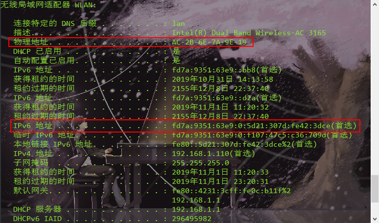

4.模式串“abaabcac”的nextval数组值是（B）

- A.01122312
- B.01021302
- C.00011201
- D.01011201

【解析】
|i|1|2|3|4|5|6|7|8|
|-----|-----|-----|-----|-----|-----|-----|-----|-----|
|s|a|b|a|a|b|c|a|c|
|next[i]|0|1|1|2|2|3|1|2|
|nextval[i]|0|1|0|2|1|3|0|2|

next求法：第一个是0或-1.依题目而定，然后如果前面有m位左右相等，next[i]=m+1。

nextval求法：第一个与next值相同，然后后面的比较位置i的字符与位置next[i]的字符是否相同，相同的话nextval[i]=nextval\[next[i]\](就是这个位置的nextval和对应next[i]位置的nextval相等)；不相同的话nextval[i]=next[i].

这个nextval是next的修正值，也就是说如果匹配失败时，模式串直接跳到nextval[j]就行了。

14.IEEE754能表示规格化数和非规格化数。

|形式|指数|小数部分|
|-----|-----|-----|
|零|0|0|
|非规约形式|0|非0|
|规约形式|1~$2^e-2$|任意|
|无穷|$2^e-1$|0|
|NaN|$2^e-1$|非零|

|格式|最小值|最大值|
|-----|-----|-----|
|单精度|E=1，M=0；$1.0*2^{1-127}=2^{-126}$|E=254,M=.111...； $1.111...*2^{254-127}=2^{127}*(2-2^{-23})$
|双精度|E=1，M=0；$1.0*2^{1-1023}=2^{-1022}$|E=2046,M=.111...；$1.111...*2^{2046-1023}=2^{1023}*(2-2^{-52})$

19.PCI的特点:

- 系统可以有多条PCI总线：每个主板大约有5~6个PCI插槽
- 能实现即插即用
- PCI总线采用隐含的集中式总线仲裁方式
- PCI总线是与处理器时钟频率无关的高速外围设备，属于局部总线。

22.下列关于DMA的叙述中，正确的是（D）

- A.DMA请求和中断请求同时发生时，中断请求先得到响应
- B.在DMA读操作中，数据经过的路径是内存->数据总线->CPU->数据总线->外设
- C.DMA的周期窃取需要等当前指令周期结束后才能启动(X)
- D.DMA方式下数据传送由硬件完成

34.在一条带宽为4kHz的信道上发送二进制信号。若该信道的信噪比(S/N)为1023，则可达到的最大传输速率为(8kbps)

【解析】两个算法取最小。第一个：二进制信号，所以$2Wlog_22=8kbps$，第二个：利用信噪比，$Wlog_2(S/N+1)=4k*10=40kbps$，取最小是8kbps。

35.若信道有噪音，数据链路层采用（字符计数法）不能正常工作

**36.下列关于链路状态路由选择协议的描述中，错误的是（A）**

- A.相邻路由器需要定期交换路由表
- B.采用Flooding技术更新链路状态信息
- C.区域内各路由器的拓扑结构数据库一致
- D.具有快速收敛的优点

【解析】链路状态路由协议，要求每个参与该算法的结点都具有完全的网络拓扑信息。执行两项任务：主动测试所有邻接结点的状态；定期地将链路状态传播给所有其他结点。最典型的就是OSPF。

三个特征：

- 向本自治系统的**所有路由器**发送信息，使用的是泛洪法(泛洪时不再发给发送信息的路由器)
- 发送的信息是与路由器**相邻的所有路由器**的链路状态，这只是路由器所知道的部分信息。
- 当链路**发生变化时**，路由器才向所有路由器发送此消息。

链路状态路由器可以用于大型的或路由信息变化聚敛的互联网环境。主要优点是：每个路由节点都使用同样的原时状态数据独立地计算路径，不依赖中间结点的计算；链路状态报文不加改变的传播。具有更好的规模可伸展性。

**它对应的另一种算法叫距离-向量路由算法，典型的是RIP。**

**38.IPv6地址的长度为128bit，MAC地址长度是48bit**



42.已知某图的邻接矩阵为A，若从顶点i到顶点j有边，则A[i,j]=1,否则A[i,i]=0.试编写一算法求矩阵A的传递包C：使得若从顶点i到顶点j有一条或多条路径，则C[i,j]=1,否则C[i,j]=0.

【解析】

```C
typedef int adjmatrix[maxvtxnum][maxvtxnum];

void Change(adjmatrix A,adjmatrix C,int n){
    // 借鉴多源最短路径的Floyd算法。可将Floyd算法简化。
    // C[i][j]=C[i][j]or(C[i][k]andC[k][j]);
    for(int i=0;i<n;i++){
        for(int j=0;j<n;j++)
            C[i][j]=A[i][j];
    }
    for(int k=0;k<n;k++){
        for(int i=0;i<n;i++)
            for(int j=0;j<n;j++)
                C[i][j]=C[i][j]or(C[i][k]andC[k][j]);
    }
    return;
}
```

47.两台计算机的数据链路层采用滑动窗口机制，用64kbps的卫星信道传输长度为1024比特的数据帧，信道的单项传播延迟为256ms。应答帧和数据帧帧头的开销忽略不计。回答下列问题。

- 计算使用停止-等待协议时信道利用率；
- 计算使用发送窗口为7时，Go-Back-N协议的信道利用率；
- 为使信道利用率达最大，使用Go-Back-N协议时帧头中序号字段至少为多少比特；
- 为避免无谓的重传，滑动窗口协议的超时重发计时器至少为多少？

(1)t=1024/64k=0.016s。信道利用率为t/(0.256*2+t)=3.03%

(2)t'=7\*0.016=0.112s。信道利用率为t'/(0.256\*2+t)=21.21%

(3)为保证100%，即xt/(0.256\*2+t)=1,x=33.这是发送窗口的大小，接收窗口最小是1，所以$2^n>=34$,n=6

(4)信道通畅时，确认帧经过0.016s+0.512s=0.528s后到达发送端。当超过0.528s后仍未收到确认帧，则数据帧可能丢失，需要重新发送。故超时重发计数器至少为0.528s。