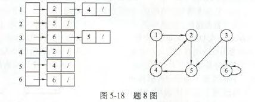
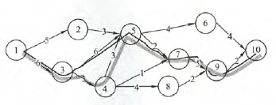
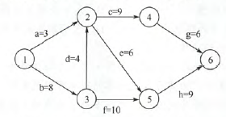
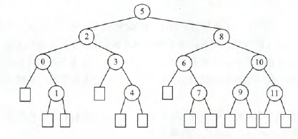
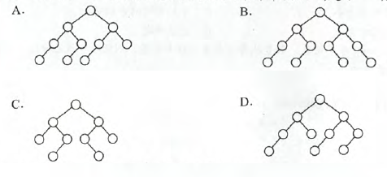
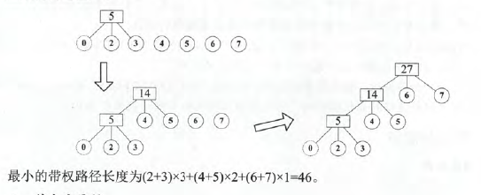

# 数据结构知识点和错题整理

1.线性表的顺序存储结构是一种（随机存取的存储结构）

2.n个元素依次进栈，能得到$C_{2n}^n / n+1$种不同出栈序列

3.已知循环队列存储在一维数组A[0……n-1]中，且队列非空时front和rear分别指向队头元素和队尾元素。若队列为空时，且要求第一个进入队列的元素存储在A[0]中，则初始时front和rear的值分别是（0，n-1）。

【解析】：进入后要执行(rear+1)%maxSize.因为这个front和rear分别指向队头和队尾，所以入队时rear先加1.如果rear指向队尾后一个，就先入再加

4.假设一循环队列Q[MaxSize]的队头指针为front，队尾指针为rear，队列的最大容量为MaxSize，除此之外，该队列在没有其他数据成员，则判断该队列满的条件是(Q.front==(Q.rear+1)%MaxSize)

5.最适合做链队的链表是(带队首指针和队尾指针的非循环单链表)

6.用链式存储方式的队列进行删除操作时需要(头尾指针可能都要修改)（删最后一个元素是）

7.假设栈初始为空，将中缀表达式a/b+(c\*d-e\*f)/g转换为等价的后缀表达式的过程中，当扫描到f时，栈中的元素依次是(+(-*)

[解析]这种题，直接分析就行，比如运行到a/b的时候，能直接算结果，c/d也是，+(-*才是这时候没运算的。

8.三对角矩阵，第一行和最后一行是两个元素，其余行是三个元素

9.对于一棵具有n个结点，度为4的树来说，(树的高度至少是n-3)，（前面都是度为1，最后来4个叶结点，这样h=n-4+1）

10.设二叉树有2n个结点，且m<n，则不可能存在(2m个度为1的结点)  ($n_0=n_2+1$,叶子节点等于度为2的结点树+1，所以$2n=n_1+2n_2+1$,即$n_1$肯定为奇数，所以不存在2m个度为1的结点)

11.完全二叉树第六层有8个叶结点，则最少(39)个结点，最多(111)个。(30=1+2+4+8+16+8,111=1+2+4+8+16+32+(32-8)*2=111,后面那个就是第六层剩余24个在第七层有叶结点)

12.已知一棵有2011个结点的树，其叶结点个数是116，该树对应的二叉树中无右孩子的结点个数是(1895)（假设这棵树116个叶结点在最后一层，其余结点度为1.所以变成二叉树时只有那116个有兄弟的会连线变成右子树，共115个右子树）

13.若有一个叶子节点是二叉树中某个子树的中序遍历结果序列的最后一个结点，则它一定是孩子树的前序遍历结果序列的最后一个结点

14.在二叉树中有两个结点m和n，若m是n的祖先，则使用**后序遍历**可以找到从m到n的路径

15.二叉树在线索化后，仍不能有效求解的问题是(**后序线索二叉树中求后序后继**)

16.**后序线索树**的遍历仍需栈的支持(全tm后续)

17.先序序列为a,b,c,d的不同二叉树的个数是(14)。类似于栈的出栈序列。$C_{2n}^n / n+1$

18.树对应的二叉树中无右孩子的结点数是(原树分支结点数+1)，无左孩子结点数(原树叶子结点数)

19.二叉排序树，关键字最大的结点右指针一定为空，废话，不为空的话右指针就比他大了

20.含有20个结点的平衡二叉树的最大深度为(6)。【最大深度算法（深度为h的最少结点数）：$n_0=0,n_1=1,n_2=2,,,n_h=n_{h-1}+n_{h-2}+1$,所以深度为$n_3=4,n_4=7,n_5=12,n_6=20$】

21.具有5层结点的AVL至少有(12)个结点。(同上)

22.若度为m的哈夫曼树中，叶子结点个数为n，则非叶子结点的个数为($\lceil (n-1)(m-1) \rceil$)【算法：m哈夫曼树只有度为0和m的结点，n个结点的哈夫曼树有n-1条分支，则$mn_m=n-1=n_m+n_0-1$,整理的$n_m=(n-1)/(m-1)$】

23.若无向图有7个顶点，保证G在任何情况下都是连通的，则需要边数最少是(16)【6个顶点强连通，需要$C_5^2=15$个边，再随意加一条即可】

24.一个有向图的邻接表存储如图，从顶点1出发，对图G调用深度优先遍历得到的顶点序列是(125436)，广度优先是(124536)

25.使用DFS算法递归地遍历一个无环有向图，**并在退出递归时**输出相应顶点，这样的到的顶点序列是（逆拓扑有序）

26.已知带权连通无向图G(V,E)，其中V={$v_1,v_2,v_3,v_4,v_5,v_6,v_7,v_8,v_9,v_{10}$},E={$(v_1,v_2)5,(v_1,v_3)6,(v_2,v_5)3,(v_3,v_5)6,(v_3,v_4)3,(v_4,v_5)3,(v_4,v_7)1,(v_4,v_8)4,(v_5,v_6)4,(v_5,v_7)2,(v_6,v_10)4,(v_7,v_9)5,(v_8,v_9)2,(v_9,v_{10}2)$},则G的关键路径的长度为(21)

【解析】画图，然后找最长路径。

27.下面什么方法可以判断出一个有向图是否有环(回路)

- 深度优先遍历（能）
- 拓扑排序（能）
- 求最短路径（不能，这个算法允许有环）
- 求关键路径（能）

28.若一个有向图具有有序的拓扑排序序列，则它的邻接矩阵必定为(三角)【可以举个例子试试，有序拓扑序列说明1，2，3，4这种，就是1肯定无入度，2的入度肯定只有1，同理。所以会是三角】

29.若用邻接矩阵存储有向图，矩阵中对角线以下的元素均为0，则关于该图拓扑序列的结论是(存在，可能不唯一)【与上面对比，全为0不一定说明有序，如果是规则的上三角或下三角，则就会有序，即三角全有元素，那么会有序，但图也不唯一，因为2指不指向4都可以】

30.下列AOE网表示一项包含8个活动的工程。通过同时加快若干活动的进度可以缩短整个工程的工期。下列选项中，加快其进度就可以缩短工程工期的是(C)

- A.c和e
- B.d和c
- C.f和d
- D.f和h

【解析】这种的话凭感觉，找到较长的路径，如同样是到2，1->2和1->3->2显然不同，所以1->3->2就是关键路径但是由2->6总时间是一样的，所以他俩都属于关键路径。另外一条到6的路径就是3->5->6，这个显然和3->2->4(5)->6相同，所以也是。所以所有关键路径是bdcg,bfh,bdeh.**所缩短工期必须减少每条关键路径**，即d和f满足条件。

31.已知一个长度为16的顺序表L,其元素按关键字有序排列，若采用折半查找法查找一个L中不存在的元素，则关键字的比较次数最多是(5),最少是(4)【5-1】

【解析】这玩意是平衡二叉树，$\lceil log_2(n+1) \rceil$或$\lfloor log_2(n)+1\rfloor$

32.折半查找和二叉排序树的时间性能是(有时不相同)【二叉排序树不一定是平衡的】

33.具有12个关键字的有序表中，对每个关键字的查找概率相同，折半查找算法查找成功的平均查找长度为(37/12)，折半查找查找失败的平均查找长度是(49/13)

【由图可知，成功1\*1+2\*2+3\*4+5\*4=37.失败3\*3+10\*4=49.除的是圆总数和方块总数】

34.下列二叉树中，可能称为折半查找判定树的是(A)

【降序，最后一层左偏，升序，最后一层右偏】

35.设顺序存储的某线性表共有123个元素，按分块查找的要求等分为3块。若对索引表采用顺序查找法来确定字块，且在确定的字块中也采用顺序查找法，则在等概率情况下，分块查找成功的平均查找长度为(23).

【解析】分为三块，说明每块41个。查第一块(2+3+4+……+42),查第二块(3+4+……+43)，查第三块(4+5+……+44)

36.下列关于B树和B+树的叙述中，不正确的是(A)

- A.B树和B+树都能有效地支持顺序查找
- B.B树和B+树都能有效地支持随机查找
- C.B树和B+树都是平衡的多叉树
- D.B树和B+树都可以用于文件索引结构

37.采用开放定址法解决冲突的散列查找中，发生聚集的原因主要是(解决冲突的方法选择不当)

38.KMP匹配失败时，i不变，j退回next[j].

39.用直接插入排序算法时，比较次数最少的情况是**表有序**

40.对下列关键字序列用快排进行排序时，速度最快的情形是(A),最慢的情形是(D)

- A.{21，25，5，17，9，23，30}
- B.{25，23，30，17，21，5，9}
- C.{21，9，17，30，25，23，5}
- D.{5，9，17，21，23，25，30}

【最快的时候是每次排完后关键字左右等分，最慢的情况是有序】

41.设线性表中每个元素有两个数据项$k_1,k_2$，对线性表按以下规则进行排序：先看数据项$k_1$，$k_1$值小的元素在前，大的元素在后；在$k_1$相同的情况下，再看$k_2$，$k_1$值小的元素在前，大的在后。满足这种要求的排序方法是(先按$k_2$进行简单选择排序，再按$k_1$进行直接插入排序)

【解析，肯定先排$k_2$，这没的说。拍好后再排$k_1$，为了防止$k_2$乱序，因此要用稳定的排序方法。所以$k_2$随意排，$k_1$必须稳定】

42.将两个各有N个元素的有序表合并成一个有序表，最少的比较次数是(N),最多是(2N-1)。【最少的是表1最大都比表2最小小。如1234，6789.最多就是比一次排一次，相互交错】

43.已知三叉树T中6个叶结点的全分别是2，3，4，5，6，7，T的带权路径长度最小是(46)

