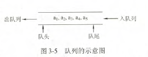
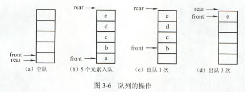
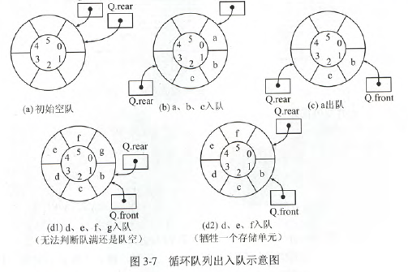
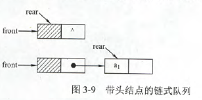
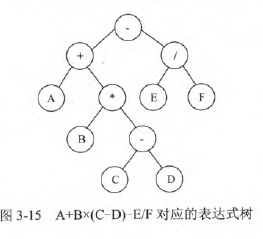
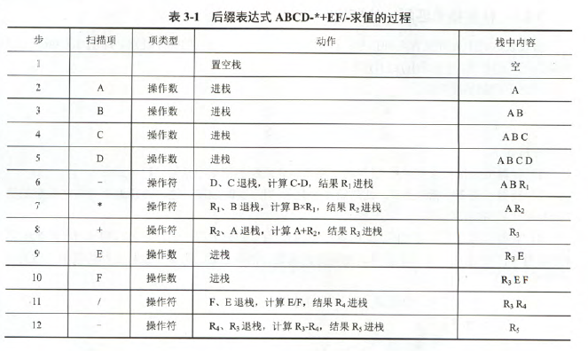
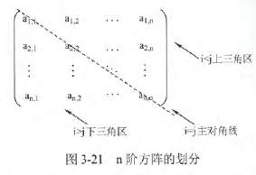
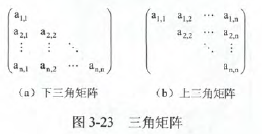
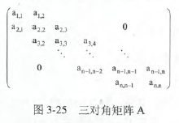
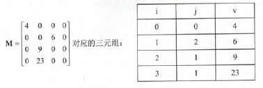

# 栈

### 栈的基本定义

只允许在一端进行插入或删除操作的线性表。栈顶：线性表允许进行插入和删除的那一端。栈底：固定的，不允许进行插入和删除的另一端。空栈：不含任何元素的空表。

n个元素入栈，出栈的所有可能性$\frac{1}{n+1}C^n_{2n}$

### 栈的顺序存储结构

顺序栈的实现：用一组地址连续的存储单元

```C
# define MaxSize 50
typedef struct{
    ElemType data[MaxSize];
    int top;              // 栈顶指针
} SqStack;
```

- 初始化

```C
void InitStack(SqStack &S){
    S.top=-1;           // 初始化时栈顶指针为-1,栈顶指针永远指向栈顶元素，即第一个元素
}
```

- 判栈空

```C
bool StackEmpty(SqStack S){
    if(S.top==-1){
        return true;
    }else{
        return false;
    }
}
```

- 进栈

```C
bool Push(SqStacj &S,ElemType x){
    if(S.top==MaxSize-1){
        return false;
    }
    S.data[++S.top]=x;     // 指针先+1，再入栈
    return true;
}
```

- 出栈

```C
bool Pop(SqStack &S,ElemType &x){
    if(S.top==-1){
        return false;
    }
    x=S.data[s.top--];  // 先出栈，指针再减1
    return true;
}
```

- 读栈顶元素

```C
bool GetTop(SqStack S,ElemType &x){
    if(S.top==-1){
        return false;
    }
    x=S.data[S.top];
    return true;
}
```

共享栈：top0=-1时0号栈为空，top1=MaxSize时1号栈为空；仅当两个栈顶指针相邻(top1-top0=1)时，栈满。当0号栈进栈时top0先加1再赋值，1号栈进栈时top1先减1再赋值；出栈刚好相反。


### 栈的链式存储结构

不存在栈满上溢的情况。通常采用单链表实现，并规定所有操作都是在单链表表头进行的。


```C
typedef struct Linknode{
    ElemType data;
    struct Linknode *next;
} *LiStack;
```

带头结点和不带头结点的栈链，在具体的实现方面有所不同。

# 队列

### 队列的基本概念

也是一种操作受限的线性表，只允许在一端进行插入，在另一端删除。队头：允许删除的一端。队尾：允许插入的一端。



### 队列的顺序存储结构

- 队列的顺序存储



```C
# define MasSize 50
typedef struct{
    ElemType data[MaxSize];
    int front,rear;
} SQueue;
```

初始状态(队空条件)：Q.front==Q.rear==0

进队操作：队不满时，先送值到队尾元素，再将队尾指针加1

出队操作：队不空时，先取队头元素值，再将队头指针加1。

不能用Q.rear==MaxSize作为队列满条件。显然(d)中，队列仅有一个元素，也满足该条件。这时入队出现“上溢出”，但这种溢出并不是真正的溢出，在data数组中依然存在可以存放元素的空位置，所以是一种“假溢出”。

- 循环队列

循环队列能弥补顺序队列的缺点。当队首指针Q.front=MaxSize-1后，再前进一个位置就自动到0，利用取余运算实现。

初始时：Q.front=Q.rear=0

队首指针进1：Q.front=(Q.front+1)%MaxSize

队尾指针仅1：Q.rear=(Q.rear+1)%MaxSize

队列长度:(Q.rear+MaxSize-Q.front)%MaxSize

出队入队时：指针都按顺时针方向进1

为了区分队空还是队满(Q.rear==Q.front),有三种处理方式

- 牺牲一个单元来区分队空和队满，入队时少用一个队列单元。队头指针在队尾指针的下一个位置作为队满的标志。
  - 队满条件：(Q.rear+1)%MaxSize==Q.front
  - 队空条件：Q.front==Q.rear
  - 队列中元素个数(Q.rear+MaxSize-Q.front)%MaxSize
- 类型中增设元素个数的数据成员。队空的条件为Q.size==0;队满的条件Q.size==MaxSize。这两种情况都有Q.front==Q.rear
- 类型中增设tag数据成员。tag等于0时，若因删除导致Q.front==Q.rear，则队为空；tag等于1时，若因插入导致Q.front==Q.rear,则为队满



循环队列的操作

- 初始化

```C
void InitQueue(SqQueue &Q){
    Q.rear=Q.front=0;
}
```

- 判队空

```C
bool isEmpty(SqQueue Q){
    if(Q.rear==Q.front){
        return true;
    }
    else return false;
}
```

- 入队

```C
bool EnQueue(SqQueue &Q,ElemType x){
    if((Q.rear+1)%MaxSize==Q.front){
        return false;
    }
    Q.data[Q.rear]=x;
    Q.rear=(Q.rear+1)%MaxSize;
    return true;
}
```

- 出队

```C
bool DeQueue(SqQueue &Q,ElemType &x){
    if(Q.rear==Q.front){
        return false;
    }
    x=Q.data[Q.front];
    Q.front=(Q.front+1)%MaxSize;
    return true;
}
```

### 队列的链式存储结构

队列的链式存储：实际上是一个带头指针和尾指针的单链表。


```C
typedef struct{
    ElemType data;
    struct LinkNode *next;
}LinkNode;

typedef struct{
    LinkNode *front,*rear;
}LinkQueue;
```

当Q.front==NULL且Q.rear==NULL时，链式队列为空。



- 初始化

```C
void InitQueue(LinkQueue &Q){
    Q.front=Q.rear=(LinkNode*)malloc(sizeof(LinkNode));
    Q.front->next=NULL;
}
```

- 判队空

```C
bool isEmpty(LinkQueue Q){
    if(Q.front==Q.rear){
        return true;
    }else {
        return false;
    }
}
```

- 入队

```C
void EnQueue(LinkQueue &Q,ElemType x){
    LinkNode *s=(LinkNode *)malloc(sizeof(LinkNode));
    s->data=x;s->next=null;
    Q.rear->next=s;
    Q.rear=s;
}
```

- 出队

```C
bool DeQueue(LinkQueue &Q,ElemType &x){
    if(Q.front==Q.rear){
        return flase;
    }
    LinkNode *p=Q.front->next;
    x=p->data;
    Q.front->next=p->next;
    if(Q.rear==p){
        Q.rear=Q.front;
    }
    free(p);
    return true;
}
```

### 双端队列

- 双端队列


- 输出受限的双端队列


- 输入受限的双端队列


[例]假设一个双端队列，输入序列为1234.则

- 能由输入受限的双端队列得到，但不能由输出受限的双端队列得到的是4,1,3,2
- 能由输出受限的双端队列得到，但不能由输入受限的双端队列得到得是4,2,1,3
- 既不能由输入受限的双端队列得到，又不能又输出受限的双端队列得到的是4,2,3,1

# 栈和队列的应用

### 栈在括号匹配中的应用

算法思想

- 初始设置一个空栈，顺序读入括号
- 若是右括号，则栈顶弹出匹配
- 若是左括号，则入栈

### 栈在表达式求值中的应用

中缀表达式A+B\*(C-D)-E/F，后缀表达式ABCD-*+EF/-



后缀表达式求值过程:遇到操作数就入栈，遇到操作符就出栈，进行运算。



### 栈在递归中的应用

效率不高，因为好多重复运算

### 队列在层次遍历中的应用


栈顶出栈后，其子结点入栈

### 队列在计算机系统中的应用

- 解决主机与外部设备之间速度不匹配的问题：如打印机。计算机先把打印输出的数据写入这个缓冲区，按照先进先出原则。
- 解决由多用户引起的资源竞争问题：阻塞队列

# 特殊矩阵的压缩存储

### 数组的存储结构


### 矩阵的压缩存储

- 对称矩阵：元素$a_{i,j}$存放在$b_k$中，只存放主对角线和下三角区的元素。对应关系$k=\frac{i(i-1)}{2}+j-1,i>=j(下三角区和主对角线元素)$，$k=\frac{j(j-1)}{2}+i-1,i<j)(上三角区元素a_{ij}=a_{ji})$



- 三角矩阵



- 三对角矩阵



- 稀疏矩阵


