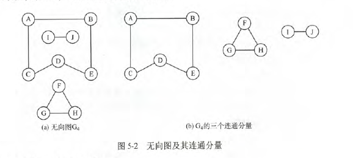
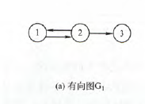
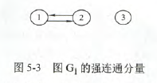

# 图的基本概念

### 图的基本定义

图G由顶点集V和边集E组成，G=(V,E)。V={$v_1,v_2,...,v_n$},E={$(u,v)|u\in V,v\in V$}.图不能是空图，图中不能一个定点都没有，但边集E可以为空。

- 有向图：E是有向边的集合，如$E_1$={<1,2>,<2,1>,<2,3>}
- 无向图：E是无向边的集合，如$E_2$={(1,2),(1,3),(2,3)}
- 简单图：满足不存在重复边，不存在顶点到自身的边。**数据结构只讨论简单图。**
- 多重图：两个结点的边数多余一条，且允许有顶点到自身的边。与简单图相对
- 完全图(简单完全图)：**在无向图中**，若任意两个顶点之间都存在边，则称该图为无向完全图。n个顶点的无向完全图有n(n-1)/2条边。有向图中，任意两个顶点之间都存在方向相反的两条弧，称为有向完全图。含有n个顶点的有向完全图有n(n-1)条边。
- 子图：有两个图G=(V,E),G'=(V',E'),若V'是V的子集且E'是E的子集，则称G'是G的子图。若V(G')=V(G)，则称其为G的生成子图(包含全部顶点)
- 连通、连通图和连通分量：在无向图中，若任意两个顶点都是连通的，则称G为连通图。无向图中的极大连通子图称为连通分量。若一个图有n个顶点，且边数小于n-1，则必是非连通图。

- 强连通图、强连通分量：**在有向图中**，若顶点v到w和w到v都有路径，称为强连通。若图中任意两点都是强连通的，称为强连通图。有向图中极大强连通子图称为强连通分量。

- 生成树、生成森林：**连通图**的生成树是包含全部顶点的极小连通子图。若顶点为n，则有n-1条边。**在非连通图中**，连通分量的生成树构成非连通图的生成森林。包含无向图中全部顶点的极小连通子图，只有生成树满足条件。
- 顶点的度、入度和出度：在无向图中，顶点的度等于依附于顶点的边数。无向图的全部顶点的度的和等于边数的2倍。有向图中，分为入度和出度。入度是以顶点为终点的边，出度是以顶点为起点的边。顶点的度=入读+出度。有向图中的全部顶点的入度等于出度等于边数。
- 边的权和网：带权的图称为带权图，也叫网
- 稠密图、稀疏图：边很少称为稀疏图，相反为稠密图。通常|E|<|V|log|V|时，视为稀疏图
- 路径、路径长度和回路：顶点$v_p$到顶点$v_q$之间的一条路径是指顶点序列$v_p,v_{i_1},v_{i_2},...,v_{i_m},v_q$.路径上**边的数目**称为路径长度。第一个顶点和最后一个顶点相同的路径称为回路或环。若一个图n个顶点，并且有大于n-1条边，则此图一定有环。
- 简单路径、简单回路：顶点不重复出现的路径称为简单路径。除第一个顶点和最后一个顶点外，其余顶点不重复出现的回路称为简单回路。
- 距离：从顶点u到顶点v的**最短路径**存在，则此路径的长度称为u到v的距离。若u到v不存在路径，则记该距离为无穷。
- 有向树：一个顶点的入度为0、其余顶点的入度均为1的有向图，称为有向树。入度为0的则是根，入度为1代表只有一个双亲结点。