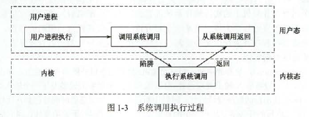

# 操作系统的基本概念

### 操作系统的概念

计算机系统自下而上可大致分为四部分：硬件、操作系统、应用程序和用户

### 特征

- 并发：并发是指两个或多个事件在**同一时间间隔**内发生。并行是指同一时刻内两个或多个事件发生
- 共享：资源共享
  - 互斥共享方式：规定在一段时间内只允许一个进程访问该资源
  - 同时访问方式：一段时间内由多个进程“同时”访问。**并发和共享**是操作系统两个最基本的特征。
- 虚拟：是指把一个物理上的实体变为若干逻辑上的对应物。
- 异步：程序并发执行时，各进程走走停停

### 操作系统的目标和功能

- 操作系统作为计算机系统资源的管理者
  - 处理机管理
  - 存储器管理
  - 文件管理
  - 设备管理
- 操作系统作为用户与计算机硬件系统之间的接口
  - 命令接口：两种方式。联机控制和脱机控制
  - 程序接口：**系统调用**
- 操作系统用作扩充机器

# 操作系统的发展和分类

### 手工操作阶段

- 用户独占全机
- CPU利用不充分

### 批处理阶段

- 单道批处理：自动行、顺序性、弹道性
- 多道批处理：多道、宏观上并行、微观上串行

### 分时操作系统

分时系统是实现人机交互的系统，特征：同时性、交互性、独立性(多个用户)、及时性。

### 实时操作系统

主要特点是及时性和可靠性

### 网络操作系统和分布式计算机系统

网络操作系统：网络中各种资源的共享及各台计算机之间的通信。

分布式操作系统：系统中的每台计算机都具有同等的地位，即没有主机也没有从机；系统上的任意台计算机都可以构成一个子系统，并且还能重构；任何工作都可以分布在几台计算机上，由它们并行工作、系统完成。

### 个人计算机操作系统

# 操作系统的运行环境

### 操作系统的运行机制

两种不同性质的程序：一种是操作系统内核程序；另一种是用户自编程序。CPU划分为用户态和核心态。

### 中断和异常的概念

### 系统调用

系统调用可视为特殊的公共子程序，凡是与资源有关的操作，都需要通过系统调用方式向操作系统请求服务。分为以下几类：

- 设备管理
- 文件管理
- 进程控制
- 进程通信
- 内存管理

**系统调用的处理**需要操作系统内核程序完成，运行在核心态。用户可以执行**陷入指令（又称访管指令或trap指令）**来发起系统调用。说明这三个指令是在用户态进行

由用户态转向核心态的例子

- 用户程序要求操作系统的服务，即系统调用
- 发生一次中断
- 用户程序中产生了一个错误状态
- 用户程序中企图执行一条特权指令
- 从核心态转向用户态由一条指令实现，这条指令也是特权指令，一般是中断返回指令（特权指令是指在核心态执行的指令）

【注意】用户态进入核心态，不仅需要状态切换，而且所用的堆栈也可能需要由用户堆栈切换为系统堆栈，但这个系统堆栈也属于该进程的。

若程序的运行由用户态转到核心态，则会用到访管指令，**访管指令是在用户态使用的，所以它不能是特权指令。**