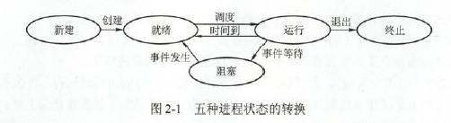

# 进程管理

### 进程与线程

进程：进程控制块。由程序段、相关数据段和PCB三部分构成了进程映像(进程实体)。所谓创建进程，实质上是创建进程映像中的PCB；而撤销进程，实质上是撤销进程的PCB。进程映像是静态的，而进程是动态的。同样，程序是静态的，进程是动态的。

**PCB是进程存在的唯一标志**

### 进程的状态与转换

- 就绪态->运行态：得到处理机调度
- 运行态->就绪态：时间片用完；更高优先级的进程就绪时，可以调度优先级更高的程序执行
- 运行态->阻塞态：请求资源失败
- 阻塞态->就绪态：资源来了

一个进程由运行态到阻塞态是主动的行为，而阻塞态变成就绪态是被动行为，需要其他相关进程的协助。

### 进程控制

- 进程的创建：允许一个进程创建另一个进程。子进程可以继承父进程所拥有的资源。子进程撤销时，应将从父进程处获得的资源还给父进程。撤销父进程时，必须同时撤销其所有的子进程。终端用户登录、作业调度、系统提供服务、用户程序的应用请求等都会引起进程的创建。创建过程
  - 为新进程分配一个唯一的进程标识号，并申请一个空白的PCB(PCB是有限的)。
  - 为进程分配资源，为新进程的程序和数据及用户栈分配必要的内存空间。**若资源不足，则并不是创建失败，而是而出处于“阻塞态”，等待的是内存这个资源**
  - 初始化PCB，包括初始化标志信息、初始化处理及状态信息和初始化处理及控制信息，以及设置进程的优先级等。
  - 若进程就绪队列能接纳新进程，则将新进程插入就绪队列。
- 进程的终止：正常结束；异常结束；外界干预。撤销过程：
  - 根据终止进程的标识符，检索PCB，从中读出该进程的状态。
  - 若被终止进程处于执行状态，立即终止该进程的执行，将处理机资源分配给其他进程
  - 若进程有子进程，则将子进程全部终止
  - 将该进程所有资源归还父进程或操作系统
  - 将PCB从所在队列中删除
- 进程的阻塞和唤醒：阻塞时进程自身的一种主动行为，也因此只有处于运行态的进程才可能将其转换为阻塞态。阻塞原语和唤醒原语
  - 找到将要被阻塞进程的标识号对应的PCB
  - 若该进程为运行态，则保护其现场，将其转换为阻塞态
  - 把该PCB插入相应事件的等待队列
  - (唤醒原语)在该事件的等待队列中找到相应进程的PCB
  - 将其从等待队列中溢出，改成就绪态
  - 该PCB插入就绪队列，等待调度
- 进程切换：从一个进程切换到另一个进程
  - 保存处理机上下文，包括程序计数器和其他寄存器
  - 更新PCB信息
  - 把进程的PCB移入相应的队列，如就绪、在某事件阻塞等队列
  - 选择另一个进程执行，更新其PCB
  - 更新内存管理的数据结构
  - 恢复处理机上下文

### 进程的组织

- 进程控制块：PCB是进程实体的一部分，是进程存在的唯一标志。操作系统通过PCB表来管理和控制进程。
- PCB信息：
  - 进程描述信息：进程标识符：标志各个进程，每个进程都有一个唯一的标识号。用户标识符：进程归属的用户，用户标识符主要为共享和保护服务
  - 进程控制和管理信息：进程当前状态：描述进程的状态信息，作为处理机分配调度的依据。进程优先级：描述进程抢占处理机的优先级，优先级高的进程可优先获得处理机
  - 资源分配清单，用于说明有关内存地址空间或虚拟地址空间的状况，所打开文件的列表和所使用的输入/输出设备信息
  - 处理机相关信息，主要指处理机中各寄存器的值，当进程被切换时，处理机状态信息都必须保存在相应的PCB中，以便在该进程重新执行时，能从断点继续执行
- 程序段:CPU执行的代码段。程序可能被多个进程共享，即多个进程可以运行同一个程序。
- 数据段：可以是原始数据，也可以是程序执行的中间或最终结果

### 进程的通信

- 共享存储：低级方式的共享是基于数据结构的共享；高级方式的共享则是基于存储区的共享。进程内的线程是自然共享进程空间的。
- 消息传递：直接通信方式：发送进程直接把消息发送到接收进程。间接通信方式:发送进程把消息发送到某个中间实体，接收进程从中间实体取得消息。这种中间实体一般称为信箱
- 管道通信：所谓“管道”，就指用于连接一个读进程和一个写进程以实现它们之间的通信的一个共享文件，又名pipe文件。【注意】：管道读数据是一次性操作，数据一旦被读取，他就从管道中被抛弃，释放空间以便写更多的数据。管道只能采用半双工通信。要实现父子进程双方互动通信，要建立两个管道。
