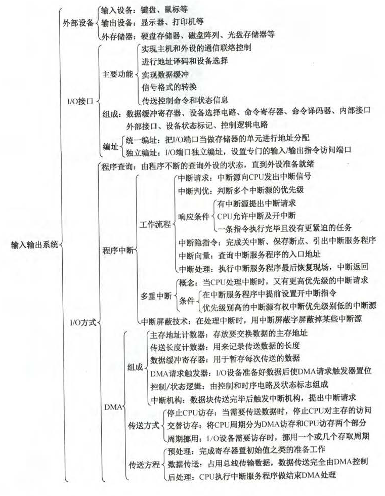

# 7.1 I/O系统基本概念

1.微型机系统中，IO设备通过(B)与主板的系统总线相连接

- A.DMA控制器
- B.设备控制器
- C.中断控制器
- D.IO端口

2.下列错误的是(D)

- A.IO指令是CPU系统指令的一部分
- B.IO指令是机器指令的一类
- C.IO指令反映CPU和IO设备交换信息的特点
- D.IO指令的格式和通用指令格式相同

【解析】IO指令格式和其他指令格式有所不同

3.以下关于通道程序的叙述中，正确的是(A)

- A.通道程序存放在主存中
- B.通道程序存放在通道中
- C.通道程序是由CPU执行的
- D.通道程序可以在任何环境下执行IO操作

【解析】通道程序存放在主存中，而非通道中。通道程序由通道执行，且只能在具有通道的IO系统中执行。

# 7.2外部设备

1.下列关于IO设备的说法中，正确的是(ABD)

- A.键盘、鼠标、显示器、打印机属于人机交互设备
- B.在微型计算机中，VGA代表的是视频传输标准
- C.打印机从打字原理的角度来区分，可分为点阵式打印机和活字式打印机
- D.鼠标适合用中断方式来实现输入操作

【分析】C的区分标准是能否打出汉字

4.显示汉字采用点阵字库，若每个汉字用16*16的点阵表示，7500个汉字的字库容量是(240KB)

【解析】16\*16为32B。32\*7500=240KB

5.假定一台计算机的显示存储器用DRAM芯片实现，若要求显示分辨率为1600*1200，颜色深度为24位，帧频为85Hz，现存总带宽的50%用来刷新屏幕，则需要的现存总带宽至少约为(7834Mb/s)

【分析】1600\*1200\*24\*85/0.5=7834

6.CRT的分辨率为1024\*1024像素，像素的颜色数为256，则刷新存储器的每单元字长为(8bit)，总容量为(1MB)

【解析】刷新存储器用来存颜色数，用8位。总容量8bit\*1024\*1024=1MB

7.一个磁盘的转速为7200转/分，每个磁道有160个扇区，每个扇区有512字节，则在理想情况下，其数据传输率为(9600KB/s)

【解析】每分钟转7200转，即传送7200次盘面数据。所以160\*512\*7200/60=9600KB/s

8.某磁盘的转速为10000转/分，转一圈6ms，平均寻道时间是3ms，磁盘传输速率是20MB/s，磁盘控制器延迟为0.2ms，读取一个4KB的扇区所需要的平均时间是(9.4ms)

【解析】传输时间4KB/20MB=0.2ms.10000转/分，转一圈是6ms，平均寻道时间3ms。所以加在一起9.4ms

9.下列选项中，用于提高RAID可靠性的措施有(AC)

- A.磁盘镜像
- B.条带化
- C.奇偶校验
- D.增加Cache机制

11.若磁盘转速为7200转/分，平均寻道时间为8ms，每个磁道包含1000个扇区，则访问一个扇区的平均存取时间大约是(12.2ms)

【分析】60/7200=8.333ms，平均时间为4.17ms。故12.2ms

# 7.3 I/O接口

1.下列选项中，在I/O总线的数据线上传输的信息包括(ABC)

- A.I/O接口中的命令字
- B.I/O接口中的状态字
- C.中断类型号

2.在统一编址的方式下，区分存储单元和I/O设备是靠(不同的地址码)

4.下列正确的是(D)

- A.按照不同的数据传送格式，可将接口分为同步传送接口和异步传送接口
- B.在统一编制方式下，存储单元和I/O设备是靠不同的地址线来区分的
- C.在独立编址方式下，存储单元和I/O设备是靠不同的地址线来区分的
- D.在独立编制方式下，CPU需要设置专门的输入/输出指令访问端口

【解析】A，分为并行接口和串行接口；B，按照不同的地址码；C，按照指令来区分的

6.下列叙述中，正确的是(D)

- A.只有I/O指令可以访问I/O设备
- B.在统一编址下，不能直接访问I/O设备
- C.访问存储器的指令一定不能访问I/O设备
- D.在具有专门I/O指令的计算机中，I/O设备才可以单独编址

【解析】统一编址下，访存指令也可以，ABC错了。在独立编址的方式下，访问IO地址空间必须通过专门的I/O指令

# 7.4 I/O方式

5.若某设备中断请求的响应和处理时间为100ns，每400ns发出一次中断请求，中断响应允许的最长延迟时间为50ns，则在该设备持续工作过程中，CPU用于该设备的I/O时间占整个CPU时间的百分比至少是(25%)

【解析】50ns为干扰信息。就是100/400=25%

9.以下说法中，以下错误的是(C)

- A.中断服务程序一般是操作系统模块
- B.中断向量方法可提高中断源的识别速度
- C.中断向量地址是中断服务程序的入口地址
- D.重叠处理中断的现象称为中断嵌套

【解析】B中，由硬件产生，不同中断源对应不同地址。C，中断向量地址是存放中断向量的地址

10.当有中断源发出请求时，CPU可执行响应的中断服务程序，可以提出中断的有(AD)

- A.外部事件
- B.Cache
- C.浮点数运算下溢
- D.浮点数运算上溢

【分析】C，下溢是机器零

11.以下关于“自陷”异常的叙述中，错误的是(C)

- A.“自陷”是人为预先设定的一种待定处理事件
- B.可由访管指令或自陷指令的执行进入自陷
- C.一定是出现某种异常情况才会发生“自陷”
- D.“自陷”发生后CPU将进入操作系统内核程序执行

【解析】自陷是人为设定的

13.下列说法中，错误的是(BCD)

- A.程序中断过程是由硬件和中断服务程序共同完成的
- B.在每条指令的指令过程中，每个总线周期要检查一次有无中断请求。
- C.检测有无DMA请求，一般安排在一条指令执行过程的末尾
- D.中断服务程序的最后指令是无条件转移指令

【解析】B：每条指令周期结束后；C：CPU会在每个存储周期(机器周期)是否有DMA；D：通常是中断返回，即恢复现场

15.中断响应由高到低的优先次序宜用(访管->程序性->重新启动)

【解析】重启应该等所有工作完成，所以最低。硬件故障优先级最高，访管指令优先级要高于外部中断

16.在具有中断向量表的计算机中，中断向量地址是(中断服务程序入口地址的地址)

20.在配有通道的计算机系统中，用户程序需要输入/输出时，引起的中断是(A)

- A.访管中断
- B.I/O中断
- C.程序性中断
- D.外中断

【解析】用户程序需要I/O时，需要调用操作系统提供的接口(请求操作系统服务)，此时会引起访管中断，系统由用户态转为核心态。

26.设置中断屏蔽标志可以改变(D)

- A.多个中断源的中断请求优先级
- B.CPU对多个中断请求响应的优先次序
- C.多个中断服务程序开始执行的顺序
- D.多个中断服务程序执行完的次序

【解析】中断屏蔽字只是改变中断处理的次序(中断响应次序由硬件排队电路决定)。

29.在各种I/O方式中，中断方式的特点是(B),DMA方式的特点是(D)

- A.CPU与外设串行工作，传送与主程序串行工作
- B.CPU与外设并行工作，传送与主程序串行工作
- C.CPU与外设串行工作，传送与主程序并行工作
- D.CPU与外设并行工作，传送与主程序并行工作

30.在DMA传送方式中，由(C)发出MDA请求，在传送期间总线控制权由()掌握

- A.外部设备、CPU
- B.DMA控制器、DMA控制器
- C.外部设备、DMA控制器
- D.DMA控制器、内存

【解析】在DMA方式中，由外部设备向DMA控制器发出DMA请求信号，然后由DMA控制器向CPU发出总线请求信号。在DMA方式中，DMA控制器在传送期间由总线控制权，这是CPU不能响应I/O中断。

33.CPU响应DMA请求的条件是当前(机器周期)执行完。(第13题)

34.下列关于中断I/O方式和DMA方式比较的叙述中，错误的是(D)

- A.中断I/O方式请求的是CPU处理时间，DMA方式请求的是总线使用权
- B.中断响应发生在一条指令执行结束后，DMA响应发生在一个总线事务完成后
- C.中断I/O方式下数据传送通过软件完成，DMA方式下数据传送由硬件完成
- D.中断I/O方式使用于所有外部设备，DMA方式仅适用于快速外部设备

35.关于中断和DMA，下列说法中正确的是(A)

- A.DMA请求和中断请求同时发生时，响应DMA请求
- B.DMA请求、非屏蔽中断、可屏蔽中断都要在当前指令结束之后才能被响应
- C.非屏蔽中断请求优先级最高，可屏蔽中断请求优先级最低
- D.若不开中断，所有终端请求就不能响应

36.下列有关DMA方式的叙述中，错误的是(B)

- A.在DMA方式下，DMA控制器向CPU请求的是总线使用权
- B.DMA方式可用于键盘和鼠标的数据输入
- C.在数据传输阶段，不需要CPU介入，完全由DMA控制器控制
- D.DMA方式要用到中断处理

【解析】DMA方式只能用于数据传输。键盘和鼠标均要求CPU立即响应，故无法采用MDA方式。

37.在主机和外设的信息传送中，(C)不是一种程序控制方式

- A.直接程序传送
- B.程序中断
- C.直接存储器存取(DMA)
- D.通道控制

【解析】只有DMA方式是靠硬件电路实现的。

38.中断发生时，程序计数器内容的保护和更新是由(A)完成的

- A.硬件自动
- B.进栈指令和转移指令
- C.访存指令
- D.中断服务程序

【解析】由中断隐指令完成

39.在DMA方式传送数据的过程中，由于没有破坏(程序计数器和寄存器)的内容，所以CPU可以正常工作。

40.在DMA方式下，数据从内存传送送到外设经过的路径是(B)

- A.内存->数据总线->数据通路->外设
- B.内存->数据总线->DMAC->外设
- C.内存->数据通路->数据总线->外设
- D.内存->CPU->外设

【分析】输出从内存经过数据总线，传送到DMA控制器的DMAC中，在传送给外设。类似这样的传输路径称为数据通路

41.在采用中断I/O方式控制打印输出的情况下，CPU和打印控制接口中的I/O端口之间交换的信息不可能是(B)

- A.打印字符
- B.主存地址
- C.设备状态
- D.控制命令

【解析】在程序中断I/O方式中，CPU和打印机直接交换，打印字符直接传送到打印机的I/O端口，不会涉及主存地址。而CPU和打印机通过I/O端口中的状态口和控制口来实现交互

42.下列关于外部I/O中的叙述中，正确的是(C)

- A.中断控制器按所接收中断请求的先后次序进行中断优先级排队
- B.CPU响应中断时，通过执行中断隐指令完成通用寄存器的保护
- C.CPU只有处于中断允许状态时，才能响应外部设备的中断请求
- D.由中断请求时，CPU立即暂停当前指令执行，转去执行中断服务程序

【解析】中断优先级由屏蔽字而非请求的先后次序决定，A错误；中断隐指令完成的工作有：1.关中断；2.断点保存；3.引出中断服务程序，通用寄存器的保护由中断服务程序完成，B错误；有中断请求时，先要由中断隐指令完成中断前程序的状态保存，D错误