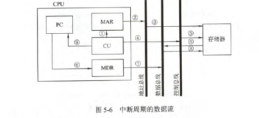

# CPU的功能和基本结构

### CPU的功能
CPU组成：

- 运算器：对数据进行加工
- 控制器：包括取指令、分析指令和执行指令

CPU功能：

- 指令控制
- 操作控制
- 时间控制
- 数据加工
- 中断处理

### CPU的基本结构

- 运算器：运算器接收从控制器送来的命令并执行相应的动作，对数据进行加工和处理。
  - 算术逻辑单元(ALU)：主要功能是进行算数\逻辑运算。
  - 暂存寄存器：用于暂存从主存读来的数据，该数据不能存放在通用寄存器中，否则会破坏原有内容。暂存寄存器对应用程序员透明。
  - 累加寄存器：通用寄存器，用于暂存ALU运算的结果，可以作为加法运算的一个输入端。
  - 通用寄存器组：AX、BX、CX、DX、SP等。用于存放操作数和各种地址信息。SP是堆栈指针，用于指示栈顶的地址。
  - 程序状态字寄存器：保留由算数逻辑运算指令或测试指令的结果而建立的各种状态信息。如溢出标志(OF)、符号标志(FS)、零标志(ZF)、进位标志(CF)等。
  - 位移器：对操作数或者结果进行位移运算。
  - 计数器：控制乘除运算的操作步数。
- 控制器：控制器的基本功能是执行指令，每条指令的执行是由控制器发生的一组微操作实现的。**分为硬布线控制器和微程序控制器**
  - 程序计数器(PC)：用于指出下一条指令在主存的存放地址。有自增功能
  - 指令寄存器(IR)：用于保存当前正在执行的那条指令
  - 指令译码器：仅对操作码字段进行译码，向控制器提供特定的操作信号
  - 存储器地址寄存器：用于存放所要访问的主存单元的地址
  - 存储器数据寄存器：用于存放向主存写入的信息或从主存中读出的信息
  - 时序系统：用于产生各种时序的信号，由统一时钟(CLOCK)分频得到
  - 为操作信号发生器：根据IR、PSW的内容及时序信号，产生控制整个计算机系统所需的各种控制信号，其结构有组合逻辑型和存储逻辑型

CPU寄存器可以分为两大类：
- 用户可见(可编程)：通用寄存器组、程序状态寄存器
- 用户不可见(对用户透明)：存储器地址寄存器、存储器数据寄存器、指令寄存器

# 指令执行过程

### 指令周期

指令周期由若干机器周期组成，一个机器周期又包含若干时钟周期。每个指令周期内机器周期数可以不等，每个机器周期内的节拍数也可以不等。

一个完整的指令周期包括**取指周期、间址周期、执行周期、中断周期**，这是四个机器周期

这四个机器周期都有CPU访存操作。取指周期为了取指令，间址周期为了取有效地址，执行周期为了取操作数，中断周期为了保存程序断点。

为了区别不同的周期，在CPU内部设置四个标志触发器。FE(取指)、IND(间址)、EX(执行)、INT(中断)

**中断周期的进栈操作是将SP-1**

### 指令周期的数据流
- 取指周期：根据PC中的内容从主存中取出指令代码并存放在IR中。

  PC->MAR->地址总线->主存

  CU发出控制信号->控制总线->主存

  主存->数据总线->MDR->IR

  CU发出读命令->PC内容加1

- 间址周期：取操作数有效地址。
  
  Ad(IR)(或MDR)->MAR->地址总线->主存

  CU发出读命令->控制总线->主存

  主存->数据总线->MDR(存放操作数的有效地址)

- 执行周期：根据IR中的指令字的操作码和操作数通过ALU操作产生结果。
- 中断周期：处理中断请求(在条指令执行结束相应中断请求)。

  CU控制将SP-1，SP->MAR->地址总线->主存

  CU发出写命令->控制总线->主存

  PC->MDR->数据总线->主存(程序断点存入主存)

  CU(中断服务程序入口地址)->PC

### 指令执行方案

- 单指令周期：所有指令都选用相同的执行时间来执行。指令周期取决于执行时间最长的指令的执行时间。会降低整个系统的运行速度
- 多指令周期：不同类型的指令选用不同的执行步骤来完成。指令之间串行执行，即下一条指令只能在该指令执行结束后执行。
- 流水线方案：指令之间并行执行，追求的目标是了力争在每个时钟脉冲周期完成一条指令的执行过程。这种方案通过在每个时钟周期启动每一条指令，尽量让多条指令同时运行，但各自处在不同的执行步骤中。

# 数据通路的基本功能和基本结构

### 数据通路的功能

数据在功能部件之间传送的路径称为数据通路.数据通路的功能是实现CPU内部的运算器与寄存器即寄存器之间的数据交换。

### 数据通路的基本结构

- CPU内部单总线方式。将所有寄存器的输入端和输出端连接到一条公共通路上。
- CPU内部三总线方式。将所有寄存器的输入端和输出端都连接到多条公共通路上。
- 专用数据通路方式。根据指令执行过程中的数据和地址的流动方向安排连接线路，避免使用共享的总线，性能较高，但硬件量大。
  
**内部总线是指同一部件，系统总线是指同一台计算机系统的各部件**

- 寄存器之间的数据传送：通过CPU内部总线完成。以PC寄存器为例，把PC内容送至MAR
  
  PC->Bus    PCout有效，PC内容送总线
  
  Bus->MAR   MARin有效，总线内容送MAR

- 主存与CPU之间的数据传送：也要借助CPU内部总线完成，以CPU从主存读取指令为例

  PC->Bus->MAR    PCout和MARin有效，现行指令地址->MAR

  1->R            CU发出读命令

  MEM(MAR)->MDR   MDRin有效

  MDR->Bus->IR    MDRout和IRin有效，现行指令->IR
  
- 执行算数或逻辑运算：**ALU本身没有内部存储功能的电路，执行加法运算，相加的两个数必须在ALU的两个输入端同时有效。**先讲一个操作数经CPU内部总线送入暂存器Y保存，Y的内容在ALU的左输入端始终有效，再将另一个操作数经总线直接送到ALU的右输入端。运算结果暂存在暂存器Z中。

  Ad(IR)->Bus->MAR    MDRout和MARin有效

  1->R                CU发出读命令

  MEM->数据线->MDR    操作数从存储器->数据线->MDR

  MDR->Bus->Y         MDRout和Yin有效，操作数->Y

  (ACC)+(Y)->Z        ACCout和ALUin有效，CU向ALU发出加命令，结果->Z

  Z->ACC              Zout和ACCin有效，结果->ACC

