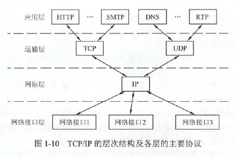

# 计算机网络概述

### 计算机网络的组成

从组成部分看，由硬件、软件和协议三部分组成

从工作方式看，由边缘部分和核心部分组成

从功能组成看，由通信子网和资源子网组成

- 通信子网：由各种传输介质、通信设备和响应的网络协议组成，使网络具有数据传输、交换、控制和存储的能力，实现联网计算机之间的数据通信。主要二层及以下
- 资源子网：实现资源共享功能的设备及其软件的集合，向网络用户提供共享其他计算机上的硬件资源、软件资源和数据资源的服务

### 计算机网络的分类

按广布范围分类：

- 广域网：是因特网的核心部分
- 城域网：大多采用以太网技术
- 局域网：局域网使用广播技术，而广域网使用交换技术
- 个人局域网：也称无线个人局域网

按传输技术分：

- 广播式网络：所有联网计算机都共享一个公共通信信道。局域网基本都采用广播是通信技术，广域网中的无线、卫星通信网络也采用广播式通信技术
- 点对点网络：每条物理线路连接一对计算机。广域网基本都属于点对点网络。

按拓扑结构分类

- 星型网络：成本高，中心结点对故障敏感
- 总线型网络：用单根传输线把计算机连接起来。重负载时通信效率不高、总线对任意一处对故障敏感
- 环形网络：连接成一个环，典型是令牌环局域网。环中信号是单向传输的
- 网状型网络：每个结点至少有两条路径与其他结点相连，多用在广域网。

按使用者分类：

- 公用网
- 专用网：军事、铁路、电力

按交换技术分类：

- 电路交换网络：源结点和目的结点建立一条专用的通路用于传送数据，包括建立连接、传输数据和断开连接三个阶段，最典型的是传统电话网络
- 报文交换网络：也称存储-转发网络。整个报文闲传送到相邻结点，**全部存储后**查找转发表，转发到下一结点。
- 分组交换网络：包交换网络。以存储-转发方式传输。主要特点是单个分组(只是整个报文的一部分)传送到相邻结点。现在主流网络基本都是分组交换网络

按传输介质分类

- 有线网络：双绞线网络、同轴电缆网络
- 无线网络：蓝牙、微博、无线电等

### 计算机性能指标

- 带宽：以前表示通信线路允许通过的信号频带范围，单位是赫兹。现在表示最高数据率，单位是比特/秒(bit/s,bps)
- 时延：数据从网络的一端传送到另一端所需要的总时间，由四部分组成
  - 发送时延：=分组长度/信道带宽
  - 传播时延：=信道长度/电磁波在信道上的传播速率
  - 处理时延：如分析首部，提取数据，差错校验等
  - 排队时延：进入路由器排队等待处理的时间
- 时延带宽积：指发送端连续发送数据且发送的第一个比特即将到达终点时，发送端已发出的比特数，即时延带宽积=传播时延*信道带宽
- 往返时延：RRT。指从发送端发送数据开始，到发送端收到来自接收端的确认总共经历的时延。
- 吞吐量：单位时间内通过某个网络的数据量
- 速率：通常把最高数据率称为带宽。

### 计算机网络体系结构与参考模型

### 计算机网络分层结构

报文一般分为两部分：一是数据部分，即SDU；二是控制信息部分，即PCI，它们共同组成PDU。

上一层只能通过相邻层间的接口使用下一层的服务，而不能调用其他层的服务；下一层所提供服务的实现细节对上一层透明。

### 计算机网络协议、接口、服务的概念

协议：就是规则的集合。不对等的实体之间没有协议。协议由语法、语义和同步三部分组成。一个完整的协议通常具有线路管理(建立、释放连接)、差错控制、数据转换等功能。

接口：同一结构相邻两层的实体通过服务访问点(SAP)进行交互。服务是通过SAP提供给上层使用的。每个SAP都有一个能标识它的地址。

服务：服务是指下层为紧邻的上层提供的功能调用，它是垂直的。

协议是水平的，即协议是控制对等实体之间通信的规则。但服务是垂直的，即服务是由下层通过层间接口向上层提供的。

服务可分为三种类型：

- 面向连接服务与无连接服务：面向连接中，通信前双方必须先建立连接，分配相应的资源。无连接服务中，不需建立连接，可直接发送，尽最大努力交付。IP，UDP是一种无连接服务的协议
- 可靠服务和不可靠服务：可靠服务是指网络具有纠错、检错、应答机制，能保证数据正确、可靠地传送到目的地。不可靠服务是指网络只是尽量正确、可靠地传送，而不保证数据正确、可靠地传送到目的地。
- 有应答服务和无应答服务：有应答服务是指接受发收到数据后向发送方给出相应的应答，该应答由传输系统内部自动实现，而不由用户实现。文件传输就是一种有应答服务。无应答是指接收方收到数据后不自动给出应答。

### ISO/OSI参考模型和TCP/IP模型

OSI有7层，自下而上依次为物理层、数据链路层、网络层、传输层、会话层、表示层、应用层。低三层称为通信子网，高三层称为资源子网。

- 物理层：传输单位是比特。规定了数据终端设备和数据通信设备的物理和逻辑连接方法。传输信息所利用的一些物理媒体，如双绞线、光缆、无线通道等，**并不在物理层，而在物理层下面**。
- 数据链路层：传输单位是帧。功能为成帧、差错控制、流量控制和传输管理。典型协议有SDLC、HDLC、PPP、STP和帧中继
- 网络层：传输单位是数据报，对分组进行路由选择，并实现流量控制、拥塞控制、差错控制和网际互连等功能。主要协议有IP、IPX、ICMP、IGMP、ARP、RARP、OSPF
- 传输层：传输单位是报文段(TCP)或用户数据报(UDP)，数据链路层提供点到点通信，传输层提供端到端通信。协议有TCP、UDP
- 会话层：会话层允许不同主机上的各个进程之间进行会话。这种服务主要为表示层实体或用户进程建立连接并在连接上有序地传输数据，这就是会话，也称建立同步。
- 表示层：主要处理两个通信系统中交换信息的表达方式。
- 应用层：是用户与网络的界面

TCP/IP模型有四层，网络接口层、网际层、传输层和应用层。网际层是TCP/IP体系结构的关键部分。但它不保证各个分组有序地到达，各个分组地有序交付由高层负责。

TCP/IP与OSI模型地比较

- OSI参考模型精确地定义了服务、协议和接口，而TCP/IP模型在这三个概念上没有明确的区分
- OSI参考模型产生在协议发明之前，通用性良好，而TCP/IP刚好相反，实用性更强
- TCP/IP模型在设计指出就考虑到多种异构网的互联问题，将网际协议作为一个单独重要层次。OSI参考模型最初只考虑到一种标准的公用数据网络各种不同系统的互联
- OSI参考模型在网络层支持无连接和面向连接的通信，但在传输层仅有面向连接的通信。而TCP/IP认为可靠性是端到端的问题，因此它在网际层仅有一种无连接的通信模型，但传输层支持无连接和面向连接两种模型。
