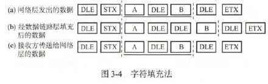
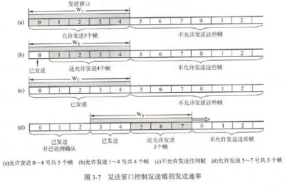
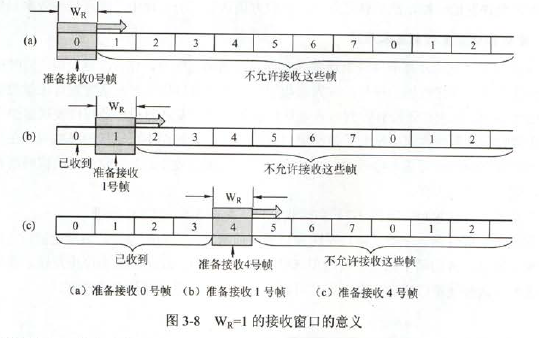
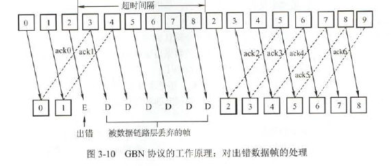
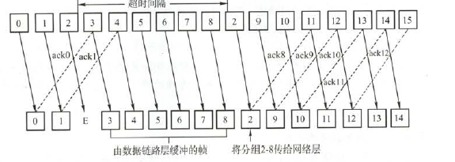
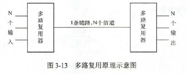

# 数据链路层的功能

### 为网络层提供服务

- 无确认的无连接服务：适用于实时通信或误码率较低的通信信道，如以太网
- 有确认的无连接服务：目的机器收到数据帧时必须确认，适用于误码率较高的通信信道，如无线通信
- 有确认的面向连接服务：三个阶段：建立数据链路、传输帧、释放数据链路。适用于通信要求较高的场合。

【有连接就一定要确认，不存在无确认的面向连接的服务，就好像没有固定分配，全局置换的】

透明传输：如果数据中恰好出现与帧定界符相同的比特组合，那么就要采取有效措施解决这个问题，即透明传输。就是不管所传数据时什么样的比特组合，都应当能在链路上传送。

流量控制：限制发送方的数据流量

# 组帧

组帧既要加首部，又要加尾部。而分组仅是包含在帧中的数据部分，不需要加尾部

### 字符计数法

字符计数法是指在帧头部用一个计数字段来标明帧内字符数。

### 字符填充的首尾定界符法

使用一些特殊字符来定界一帧的开始与结束。可以在数据的特殊字符前填充一个转义字符加以区分。接收方发现特殊字符前有转义字符就知道这是数据而不是控制信息。



### 比特填充的首位标志法

一般用01111110来表示一帧的开始与结束。而在数据中出现这组比特时，在5个1后加个0.如数据为111110000011111011100011111010,表示真正的数据时111110000111111110001111110.很容易用硬件实现，性能优于字符填充法

### 违规编码法

物理层进行比特编码时，通常采用违规编码发。例如曼彻斯特编码将1表示为高低电平，0表示为低高电平，所以理应不存在高高和低低电平，因此采用高高或低低电平用作帧的开始或结束

目前比较常用的是比特填充法和违规编码法

# 差错控制

传输中的差错都是噪声引起的。分为两类：

- 随机热噪声：提高信噪比可减少或避免干扰
- 冲击噪声：没有解决办法，是差错的主要原因

利用编码技术的差错控制：

- 自动重传请求：ARQ
- 前向纠错：FEC，又分检错编码和纠错编码。

#### 检错编码

都是用冗余编码技术

- 奇偶校验码
- 循环冗余码

```
设生成多项式为G(x)=x^3+x^2+1，信息码为101001，求CRC

R=生成多项式做高位幂次=3，K=6，N=R+K=9
G(x)对应的二进制编码为1101

1、移位
将原信息左移R位，低位补0，得到101001000
2、相除
模二除法，不借位
          110101  <--商
1101 | 101001000
       1101
        1110
        1101
          1110
          1101
            1100
            1101
             001  <--余数
得到余数为001，则CRC码为101001001
3、检错和纠错
接收端收到CRC码，用生成多项式G(x)做模二除法，若余数为0，则码字无错
若接到的CRC码为C9C8C7C6C5C4C3C2C1-101001011，将这个数据与1101进行模二除法，得到余数为010，说明C2出错，C2取反即可。
```

### 纠错编码

汉明码

``` java
在n=4，k=3时，求1010的汉明码
1、确定汉明码的位数
n+k<=2^k-1  (n为有效信息的位数，k为校验位)
4+3<=7，即k=3符合。所以有效信息D4D3D2D1(1010)共四位，校验位P3P2P1共三位。
所以汉明码为H7H6H5H4H3H2H1
2、确定校验位的分布
第一位校验码 P1 2^0=1,即H1=P1
P2 2^1=2，即H2=P2
P3 2^2=4，即H4=P3
所以对应为
H7H6H5H4H3H2H1
D4D3D2P3D1P2P1
3、分组已形成校验关系
被校验数据位的汉明位号等于校验该数据位的各校验位汉明位号之和
D1放在H3上，由H1和H2校验
D2放在H5上，由H1和H4校验
D3放在H6上，由H2和H4校验
D4放在H7上，由H1和H2和H4校验
4、校验位取值
放在H1上的P1负责校验D1，D2，D4，
P1=D1异或D2异或D4=0 1 1=0
P2 D1，D3，D4
P2=D1异或D3异或D4=0 0 1=1
P3 D2，D3，D4
P3=D2异或D3异或D4=1 0 1=0
所以对应汉明码为1010010
5、校验
S1=P1异或D1异或D2异或D4
S2=P2异或D1异或D3异或D4
S3=P3异或D2异或D3异或D4
若S3S2S1=000，则无错。如S3S2S1=001，则第一位出错。
```

# 流量控制与可靠传输机制

### 流量控制、可靠传输与滑动窗口机制

流量控制基本方法是由接收方控制发送方速度。

- 停止等待流量控制基本原理：发送方每发送一帧，都要等待接收方的应答信号，之后才能发送下一帧。如果接收方不反馈应答信号，发送方必须等待
- 滑动窗口流量控制基本原理：发送方维持一组连续的允许发送的帧的序号，称为发送窗口；接受放维持一组允许接收的帧的序号，称为接收窗口。发送窗口用来对发送方进行流量控制，发送窗口的大小$W_T$代表在还未收到对方确认信息的情况下发送方最多还可以发送多少个数据帧。在接收端设置窗口是为了控制可以接收那些数据帧和不可以接收那些帧。在接收方，只有收到的数据帧的序号落入接收窗口之内时，才允许将该数据帧收下。





发送端每收到一个确认帧，发送窗口就向前滑动一个帧的位置。接收端口收到数据帧后，将窗口向前移一个位置，并发回确认帧。

有以下特性：

- 只有接收窗口向前滑动时，发送窗口才有可能向前滑动(收到确认后)
- 停止-等待协议、后退N帧协议和选择重传协议只在发送窗口大小与接收窗口大小上有区别
  - 停止-等待协议：发送窗口大小=1，接收窗口大小=1
  - 后退N帧协议：发送窗口大小>1，接收窗口大小=1
  - 选择重传协议：发送窗口大小>1，接收窗口大小>1
- 接收窗口为1时，可以保证帧的有序接收
- 数据链路层的滑动窗口协议中，窗口的大小在传输过程中是固定的(与传输层的滑动窗口有区别)

可靠传输机制：通常使用确认和超时重传完成。

- 确认是无数据的控制帧，为了提高效率，将确认捎带在一个回复帧中，称为捎带确认。
- 超时重传是通过接收方请求发送方重传出错的数据帧来恢复出错的数据。分为三种，停止-等待ARQ、后退N帧ARQ、选择性重传ARQ。后两者是滑动窗口技术与请求重发技术的结合，由于窗口尺寸开的足够大时，帧在线路上可以连续的流动，又称其为连续ARQ协议

### 单帧滑动窗口与停止等待协议

停止等待协议还可能出现两种错误：

- 到达接收方的帧已损坏，接收方丢弃。这时要在发送方设置一个计时器，发送一个帧后，发送方等待确认，若计时器计满仍未收到，则重发。
- 数据帧正确而确认帧损坏，这样发送方就无法收到确认帧。此时发送方会重传，接收方收到同样的数据帧就丢弃，并重传一个确认帧。发送方发送的帧分别交替用0，1表示，接收方确认帧分别用ACK0，ACK1表示，收到的确认与发送的序号不符，重传已发送的帧。【0号用0，1号用1，2号用0等等。如果重传1号，依然用1】若连续出现相同发送序号的数据帧，表明发送端进行了超时重传。

### 多帧滑动窗口与后退N帧协议(GBN)

发送方无需收到接收方的确认帧后才能发送下一帧，即可以连续发送。当接收方检测出错误帧后，要求发送方重发最后一个正确接收的帧及之后的帧；或当发送方发送了N个帧后，若发现该N个帧的前一个帧在计数器超时后仍未返回确认信息，则发送方就重传出错帧和随后的N个帧。接收方只允许按顺序接收

GBN规定接收端不一定对所有帧都需要确定，而是可以在连续收到好几个正确的帧后，才对最后一个数据帧确认信息。或者可以在自己有数据要发送时才将对以前正确收到的帧捎带确认。对某一帧的确认就表明该数据帧和以前所有数据帧均已正确无误地收到。

后退N帧协议地接收窗口大小为1，可以保证按需接受数据帧。若采用n比特对帧编号，则发送窗口地尺寸$W_T$应满足$1<=W_T<=2^n-1$.否则接收方无法分清新帧和旧帧

若信道传输质量很差导致误码率很大时，后退N帧协议不一定优于停止-等待协议。



### 多帧滑动窗口与选择重传协议(SR)

只传出错的数据帧和超时的数据帧。此时必须加大接收窗口。

每个发送缓冲区对应一个计时器，当计时器超时时，缓冲区的帧就会重传。接收方怀疑帧出错，就会发送一个否定帧NAK给发送方，要求发送方重传对应帧。



若采用n比特对帧编号，则$接收窗口W_R+发送窗口W_T<=2^n$.并且接收窗口$W_R<=2^{(n-1)}$,即发送窗口和接收窗口最大值为$W_R<=2^{(n-1)}$。通常两者相等。

接收端要设置相当容量的缓冲区来暂存那些未按序正确收到的帧。

信道效率(信道利用率)=有效数据所需的发送时间占整个发送周期的比率。

信道吞吐率=信道利用率*发送方的发送速率

# 介质访问控制

为使用介质的每个结点隔离来自同一信道上其他结点所传送的信号，以协调活动结点的传输。

### 信道划分介质访问控制

将使用设备的每个设备与来自同一通信信道上的其他设备通信隔离开。

采用多路复用技术可以把多个输入通道的信息整合到一个复用通道中，在接收端把收到的信息分离出来并传送到相应的信道。



- 频分复用(FDM)：将物理信道的总带宽分割成若干与传输单个信号带宽相同的子信道，每个子信道传输一种信号。每个子信道带宽可不相同，相邻信道之间需要加入“保护频带”，共享时间不共享空间
- 时分复用(TDM)：将物理信道分成若开时间片，某时刻看，传送的是某一对设备间的信号；某段时间上看，传送的是按时间分割的多路复用信号。统计时分复用(STDM)，不固定分配时隙，按需动态地分配时隙。【例如，线路传输率为8000b/s，四个用户平均2000b/s。TDM时，每个用户最大2000b/s，而STDM，每个用户最大8000b/s】
- 波分多路复用：在一根光纤中传输多种不同波长地光信号。
- 码分多路复用：采用不同地编码来区分各路原始信号的方式。既共享信道的频率，又共享时间。码分多址复用是其方式(CDMA)。简单说就是A向C发送的信号量用一个向量来表示，B向C发送的信号用另一个向量来表示，两个向量要求相互正交。向量中的分量，就是码片。

【例】A的码片为00011011，A发送00011011就是发送比特1，发送11100100就是发送比特0.按惯例将码片序列中的0写成-1，1写成+1.A发送的就是-1-1-1+1+1-1+1+1.

令向量S表示A的码片向量，向量T表示B的码片向量。两个不同站的码片向量正交，即S·T=0.任何一个码片自己内积是1，与其反码内积是0.

令向量T为(-1-1+1-1+1+1+1-1).

当A发送1时，(-1-1-1+1+1-1+1+1)

当B发送0时，(+1+1-1+1-1-1-1+1)

线性叠加后，(0 0 -2 2 0 -2 0 2).

C收到后，用线性叠加的结果·A=1，即A发送了1，结果·B=-1，即B发送了0。主要用于无线通信系统，特别是移动通信系统

### 随机访问介质访问控制

常用的有ALOHA、CSMA、CSMA/CD和CSMA/CA协议。核心思想是：胜利者通过征用获得信道，从而获得信息的发送权。

ALOHA协议：

- 纯ALOHA协议：当网络中任何一个站点需要发送数据时，可以不进行任何检测就发送数据。如果一段时间未收到确认，那么就认为发生了冲突。发送站点需要等待一段时间后再发送数据，直至发送成功。纯ALOHA协议网络的吞吐量很低。
- 时隙ALOHA协议：各站在时间上同步起来，并将时间划分为一段段等长的时隙，规定只能在每个时隙开始时才能发送一个帧。

CSMA协议：

与ALOHA协议的区别是多了一个载波监听装置

- 1-坚持CSMA：一个结点发送数据时，先监听，如果空闲立刻发送；如果忙，则等待，同时继续监听直至信道空闲；如果发生冲突，那么随机等待一段时间后，再重新开始侦听信道。“1-坚持”就是忙时，继续监听；空闲后，立刻发送，发送概率为1.延迟会导致冲突，不考虑延迟也会产生。如A正在发送，BC监听忙，A发送完后，BC一起发送，就冲突了
- 非坚持CSMA：发送数据时，先监听，空闲就发送；忙的话，放弃监听，等待一个随机事件重复上述过程。降低了多个结点等待信道空闲后同时发送数据导致冲突的概率。
- p-坚持CSMA：用于时分信道。一个结点发送数据时，先监听；如果忙，等待下一个时间间隙再侦听；如果空闲，以概率p发送，以1-p推迟到下一个时隙；如果下一个时隙空闲，仍以概率p发送，以1-p推迟到下一个时隙。这个过程一直持续到发送成功或检测到信道忙为止，检测到信道忙时，等待一个随机的时间后重新监听。(两种信道忙的情况处理不同)

三种比较

|信道状态|1-坚持|非坚持|p-坚持|
|-----|-----|-----|-----|
|空闲|立即发送数据|立即发送数据|以概率p发送数据，以概率1-p推迟到下一个时隙|
|忙|继续坚持侦听信道|放弃侦听，等待一个随机的时间后再侦听|持续侦听，等待下一个时隙再侦听|

CSMA/CD

载波监听多路访问/碰撞检测，适用于总线型网络或半双工网络环境。

工作流程为：先听后发，边听边发，冲突停发，随即重发

总线的传播时延对CSMA/CD的影响很大。只能进行半双工通信。

$2\tau$为争用期，其中$\tau$为单程传播延迟。只有经过争用期这段时间没有检测冲突，才能确定这次传输不会产生冲突。

帧的传输时延至少要两倍于信号在总线中的传播时延。

最小帧长=总线传播时延\*数据传输率\*2

以太网规定最短帧长为64B，凡是长度小于64B都为无效帧。

二进制指数退避算法：

1.确定基本退避时间，一般取$2\tau$，即争用期。(2倍总线端到端传播时延)

2.**定义参数k，等于重传次数，但k不超过10.k=min[重传次数，10]**

3.从离散数据集中[$0,1,...,2^k-1$]随机取一个数r，重传所需的退避时间就是$2r\tau$

4.**当重传超过16次时，认为此帧永远发不出去，抛弃此帧并向高层报告。**

CSMA/CA

广泛应用于无线局域网。把碰撞检测改为碰撞避免。

也采用二进制指数退避算法。信道从忙变成空闲时，任何一个站要发送数据帧时，不仅都需等待一个时间间隔，而且还要进入争用窗口，并计算随机退避时间以便再次试图接入信道，因此降低了发生碰撞的概率。当且仅当检测到信道空闲且这个数据帧是要发送的第一个数据帧时，才不使用退避算法。

还使用预约信道、ACK帧、RTS/CTS三种机制避免碰撞：

- 预约信道：发送方发送数据时通信向其他站点通知自己传输数据的时间长度。
- ACK帧：所有站点正确收到发给自己的帧后，向发送方发送一个ACK，如果接收失败，什么都不做。发送方发送完一个帧后，在规定时间内未收到ACK，则重发。
- RTS/CTS帧：可选。主要解决无线网中的屏蔽站问题。

前两者必须实现。后两者又增加了网络流量。

CSMA/CD与CSMA/CA区别：

- CD可以检测冲突，但不能避免；CA不能检测，只能尽量避免
- 传输介质不同。
- 检测方式不同。CD通过电缆电压，CA采用能量检测、载波检测和能量载波混合检测
- 在本结点有(无)冲突，并不一定意味着在接收结点有(无)冲突

CSMA/CA时在发送数据时先广播告知其他结点，让其他结点在某段时间内不要发送数据，以免碰撞。CSMA/CD时发送前监听，边发送边监听，一旦出现碰撞马上停止发送。

### 轮询访问介质访问控制：令牌传递协议

令牌传递协议中，一个令牌在各节点间以固定次序交换。令牌是由一组特数的比特组合而成的帧。当环上的一个站希望传送帧时，必须等待令牌。一旦收到令牌，站点便可启动发送帧。不管该帧是否发送给本站点的，所有站点都进行转发，直到该帧回到它的始发站，并由该始发站撤销。帧的目的站转发时，要加入响应比特。发送站发送完一帧后，应释放令牌。**令牌只有一个**。物理拓扑不必是一个环，但逻辑拓扑必须是一个环。非常适合负载很高的广播信道。

# 局域网

### 局域网的基本概念和体系结构

主要特点

- 为一个单位所拥有
- 所有站点共享较高的总带宽
- 较低的时延和较低的误码率
- 各站为平等关系而非主从关系
- 能进行广播和组播

拓扑结构：星型结构；环形结构；总线型结构；星形和总线型符合结构

传输介质：双绞线、铜缆、光纤等。双绞线为主流

介质访问控制方法主要有：CSMA/CD，令牌总线和令牌环。前两种主要用于总线型，令牌环主要用户令牌环网。

三种特殊局域网

- 以太网：逻辑拓扑总线型，物理拓扑是星形或拓展星形
- 令牌环：逻辑环形，物理星形
- FDDI：逻辑环形，物理双环结构

局域网只有数据链路层和物理层。数据链路层又分为逻辑链路控制(LLC)和媒体接入控制子层(MAC).MAC主要功能：组帧和拆卸帧、比特传输差错检测、透明传输。LLC向网络层提供无确认无连接、面向连接、带确认无连接、高速传送四种方式(有连接就一定有确认)

